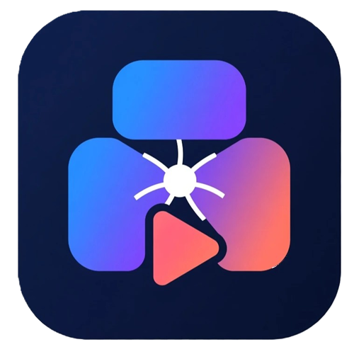
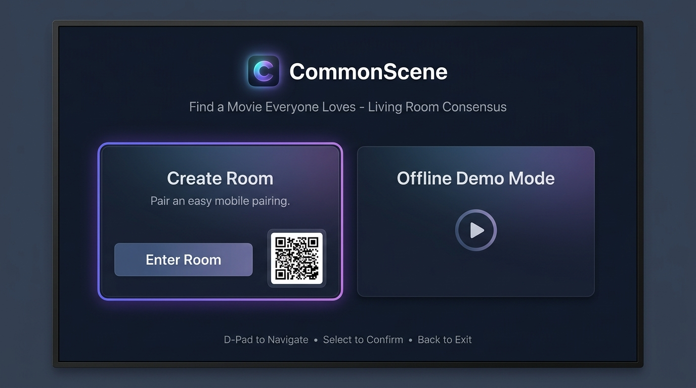
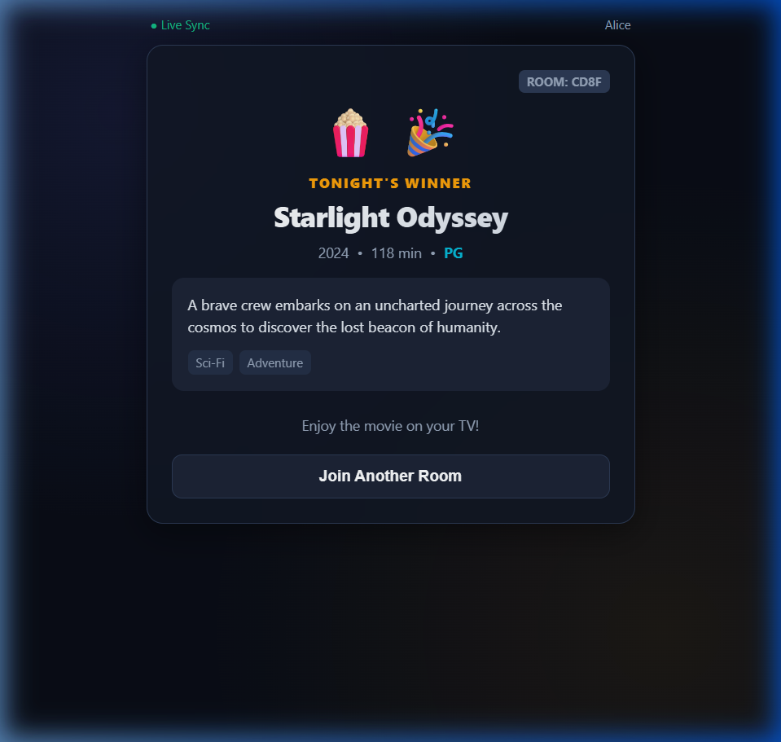

<div align="center">
  
  <h1>CommonScene</h1>
  <p><strong>Fire TV-first group movie recommendation</strong> — turning household movie-night paralysis into instant, fair consensus.</p>

  <p><em>Built for the <strong>Build, Ship, Shape: Amazon Developer Hackathon 2026</strong></em></p>

  [](https://github.com/pakorn269/commonscene/actions/workflows/ci.yml)
  [](./LICENSE)
  [-orange.svg)](https://developer.amazon.com/fire-tv)
  [](https://aws.amazon.com/bedrock/)
  [](https://aws.amazon.com/cdk/)
  [](https://www.typescriptlang.org/)
</div>

---

## 🎯 The Problem & The Solution

**The Problem:** Every household knows the "30-minute scroll" — sitting on the couch endlessly browsing streaming menus, arguing over genres, runtimes, and ratings until everyone loses interest. Individual recommendation algorithms optimize for a single profile, ignoring the group dynamic and hard time constraints.

**The Solution:** CommonScene is a television-first experience that turns group movie selection into an interactive, democratic game:
1. **Fire TV Host:** Displays a large 4-letter room code and QR join link on the television.
2. **Instant Mobile Joining:** Up to dozens of viewers join on their phones without creating an account or downloading an app (via Mobile PWA).
3. **Smart Preferences:** Viewers select genres, moods, maximum runtime, and rating ceilings — or type natural language preferences.
4. **Deterministic Fairness Engine:** Ranks movies using a mathematical fairness formula where hard constraints are never overridden.
5. **Amazon Bedrock Explanations:** Explains recommendations in natural language, grounded strictly in verified score data.
6. **Live Living Room Vote:** TV showcases top 3 finalists. Everyone votes on their phone, and the TV crowns the winner with cinema fanfare!

<div align="center">
  
  <p><em>CommonScene 10-foot television interface running on Fire TV (Vega OS)</em></p>
  <br />
  
  <p><em>Realtime group participant voting & winner celebration on Mobile PWA</em></p>
</div>

---

## ✨ Key Features

| Feature | Description |
| :--- | :--- |
| 📺 **10-Foot Fire TV UI** | Native React Native on **Vega OS** with full D-pad remote navigation, visual focus indicators ($\ge 3\text{px}$), and 5% TV-safe overscan margins. |
| 📱 **Zero-Friction Mobile PWA** | Pure web participation at `http://localhost:5173` (or production CloudFront URL). No account creation, passwords, or app installation required. |
| ⚖️ **Deterministic Consensus** | Pure TypeScript algorithm balancing average satisfaction, minimum viewer happiness, and preference coverage. Ties broken deterministically. |
| 🤖 **Amazon Bedrock Integration** | Server-side Converse API (`anthropic.claude-3-5-sonnet` / `amazon.nova-lite`) for free-text parsing and natural consensus explanations with 100% offline fallback. |
| ⚡ **Realtime WebSocket Sync** | Low-latency state synchronization across TV and mobile devices via Fastify WebSocket event hub. |
| ☁️ **AWS Serverless IaC** | Complete AWS CDK v2 stack defining Amazon DynamoDB (with TTL), S3 + CloudFront (OAC), and Bedrock IAM policies. |
| 🍿 **90-Second Offline Demo** | Built-in offline demo mode on Fire TV with predictable test profiles (Alice, Bob, Charlie) that runs completely without external services. |

---

## 📐 System Architecture

```
                       ┌─────────────────────────────────────────┐
                       │     Fire TV / Vega OS Simulator         │
                       │  apps/tv (React Native + Hermes Engine) │
                       │    D-pad Nav • 5% Safe Margins • PWA QR │
                       └───────────────────┬─────────────────────┘
                                           │ WebSocket + REST
                               ┌───────────▼───────────┐
                               │  services/api         │
                               │  Fastify + WebSocket  │
                               └─────┬───────────┬─────┘
                     Deterministic   │           │   Grounded Explanations
                   Consensus Scoring │           │   & Free-Text Parsing
                 ┌───────────────────▼──┐     ┌──▼──────────────────┐
                 │ packages/consensus   │     │ Amazon Bedrock      │
                 │ Pure TypeScript      │     │ Claude 3.5 Sonnet / │
                 │ 0.45·Avg + 0.35·Min  │     │ Amazon Nova Lite    │
                 │ + 0.20·Coverage      │     │ (Zero-Error Fallback│
                 └──────────────────────┘     └─────────────────────┘
                                           ▲
                                           │ WebSocket + REST
                       ┌───────────────────┴─────────────────────┐
                       │       Mobile Participant PWA            │
                       │   apps/mobile (React 19 + Vite + PWA)   │
                       │    No App Install • No Login Required   │
                       └─────────────────────────────────────────┘
```

---

## ⚖️ Mathematical Consensus Formula

For each candidate movie $m$ in the local catalog:

$$\text{Score}(m) = 0.45 \cdot \text{Avg}(m) + 0.35 \cdot \text{Min}(m) + 0.20 \cdot \text{Coverage}(m) - \text{Penalty}(m)$$

- **$\text{Avg}(m)$ (45%)**: Average preference satisfaction across all participants.
- **$\text{Min}(m)$ (35%)**: Minimum satisfaction score among all participants (Nash-inspired fairness component preventing majority tyranny).
- **$\text{Coverage}(m)$ (20%)**: Percentage of unique soft preferences across the entire group satisfied by movie $m$.
- **$\text{Penalty}(m)$**: Deductions for minor soft conflicts.
- **Hard Constraints**: Movies exceeding any participant's maximum runtime, rating ceiling, or containing excluded genres/tags are strictly marked ineligible ($\text{Score} = 0$).

---

## 📁 Repository Layout

```text
commonscene/
├── apps/
│   ├── mobile/                 # React 19 + Vite + TypeScript participant PWA
│   └── tv/                     # React Native Vega OS application (10 screens)
├── services/
│   └── api/                    # Fastify REST & WebSocket realtime server
├── packages/
│   ├── catalog/                # Fictional movie catalog with rich metadata
│   ├── consensus/              # Deterministic mathematical recommendation engine
│   ├── contracts/              # Shared Zod schemas, TypeScript types & event names
│   ├── test-fixtures/          # Shared test rooms and preference profiles
│   └── ui-tokens/              # Color palettes, typography, spacing tokens
├── infrastructure/
│   └── cdk/                    # AWS CDK v2 cloud infrastructure definitions
├── docs/
│   ├── architecture.md         # System architecture & realtime protocol
│   ├── phase1-setup.md         # Vega Virtual Device setup guide for WSL 2
│   ├── friction-log.md         # Developer friction log (6 entries)
│   ├── product-feedback.md     # Structured feedback on Vega SDK, VPT & Bedrock
│   ├── submission-checklist.md # Hackathon requirements compliance matrix
│   └── devpost-submission.md   # Devpost submission draft & 2:45 video script
├── AGENTS.md                   # AI agent rules and domain model
├── MVP-PHASE-PLAN.md           # Milestone plan and acceptance criteria
└── README.md                   # Project overview & quickstart guide
```

---

## 🚀 Quick Start

### Prerequisites
- **Node.js**: `20.0.0 LTS` or higher
- **npm**: `10.0.0` or higher
- **WSL 2** (Windows 11) with Ubuntu 24.04 LTS (for Vega OS TV simulator)

### 1. Installation & Environment Setup
```bash
# Clone the repository
git clone https://github.com/pakorn269/commonscene.git
cd commonscene

# Install all workspace dependencies
npm install

# Copy the environment template
cp .env.example .env
```

### 2. Verify Code Quality & Test Suite
```bash
# Run ESLint, TypeScript typecheck, and Vitest suite (33 passing tests)
npm run lint
npm run typecheck
npm test
npm run build
```

---

## 💻 Running Locally

### 1. Fastify API Server
```bash
npm --workspace=@commonscene/api run dev
```
Starts on `http://localhost:3001` (REST `/api/v1/...` and WebSocket `/ws/rooms/:roomCode`).

### 2. Mobile Participant PWA
```bash
npm --workspace=@commonscene/mobile run dev
```
Open `http://localhost:5173` in any desktop or mobile browser. Enter any 4-letter room code to join.

### 3. Fire TV App (Vega OS Simulator)
```bash
# In WSL 2 Ubuntu with Vega SDK:
cd apps/tv
npm run build:release
vpt pack build/private/vega/x86_64/Release -n tv_x86_64 -d /tmp/tv_output --validate
vega run-app /tmp/tv_output/tv_x86_64.vpkg com.commonscene.tv.main -d VirtualDevice
```
Use D-pad remote keys (`Up`, `Down`, `Enter`, `Escape`) to navigate on the TV.

---

## ☁️ AWS Cloud Deployment (AWS CDK)

Synthesize CloudFormation templates:
```bash
npm --workspace=@commonscene/cdk run synth
```

Deploy infrastructure to your AWS account:
```bash
npm --workspace=@commonscene/cdk run deploy
```

---

## 📚 Documentation Hub

- 🏛️ **[System Architecture](docs/architecture.md)** — Detailed component overview, recommendation lifecycle, and data flow.
- 🛠️ **[Vega Virtual Device Setup](docs/phase1-setup.md)** — Step-by-step WSL 2 setup guide for the Vega CLI and simulator.
- 🔍 **[Developer Friction Log](docs/friction-log.md)** — 6 detailed friction logs with root causes and workarounds.
- 💡 **[Amazon Product Feedback](docs/product-feedback.md)** — Structured developer feedback for Vega OS, Kepler React Native, `vpt`, and Bedrock.
- ✅ **[Submission Checklist](docs/submission-checklist.md)** — Full hackathon requirements compliance checklist.
- 🎬 **[Devpost Submission & Video Script](docs/devpost-submission.md)** — Submission pitch and timed 2:45 demo video script.

---

## 🏆 Hackathon Track Alignment

- **Primary Track:** Fire TV
  - *Priority Categories:* AI-Enhanced Viewing, Family Entertainment
- **Mini Challenges:**
  - *AWS Builder:* Fully integrated Amazon Bedrock (Claude 3.5 Sonnet / Nova Lite) + AWS CDK v2 IaC stack (DynamoDB, S3, CloudFront).
  - *Open Source:* 100% open-source under Apache-2.0 with modular monorepo packages, strict TypeScript, and complete test suites.

---

## 📜 License

[Apache-2.0](./LICENSE) © 2026 CommonScene Contributors
